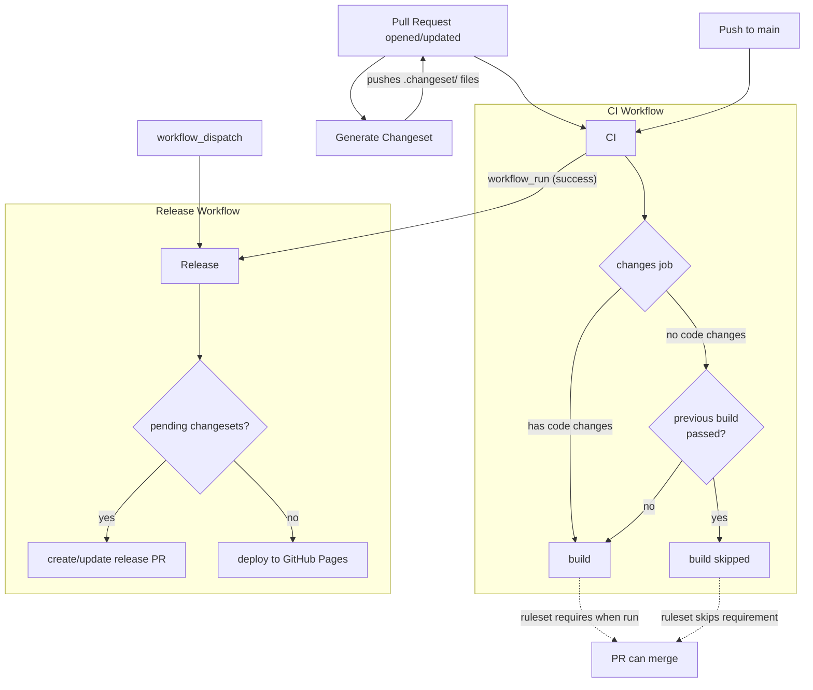

# CI/CD Workflows

## Flow Overview

## Workflows

| Workflow | File | Triggers | Purpose |
|----------|------|----------|---------|
| **CI** | `ci.yml` | push to `main`, pull requests | Build all packages |
| **Release** | `release.yml` | after CI succeeds on `main`, manual | Version packages via changesets, publish `@zzfx-studio/zzfxm` to npm, deploy PWA to GitHub Pages |
| **Generate Changeset** | `changeset.yml` | pull requests (opened, synchronize) | Auto-generate changeset files from conventional commits |

## Path Filtering

### CI (`ci.yml`)

| Ignored Path | Reason |
|---|---|
| `.changeset/**` | Release metadata, not code |
| `.claude/**` | AI config |
| `docs/**` | Documentation |
| `scripts/**` | Utility scripts |
| `**/*.md` | Prose |
| `LICENSE` | Legal text |

**Push to main:** Uses `paths-ignore` — workflow doesn't run at all for ignored-only changes.

**Pull requests:** Always triggers, but the `changes` job checks whether the **latest commit** contains code changes. If the latest commit only touches ignored paths **and** the previous commit's build passed, the build is skipped.

### Generate Changeset (`changeset.yml`)

No path filtering. Runs on every PR open/sync, but self-skips if the latest commit message is `"ci: generate changesets"` to prevent infinite loops.

## Release Flow

The release workflow uses `changesets/action`:

1. **Pending changesets exist** → Creates/updates a "chore: release" PR that bumps versions in `package.json` files
2. **No pending changesets** (release PR was just merged) → Publishes `@zzfx-studio/zzfxm` to npm, then deploys the PWA to GitHub Pages

This gates releases behind an explicit version bump approval — merging the release PR triggers npm publish and deploy.

## Secrets

| Secret | Purpose |
|---|---|
| `NPM_TOKEN` | npm publish token for `@zzfx-studio/zzfxm` |
| `COPILOT_PAT` | GitHub PAT for Copilot CLI changeset enhancement |

## Concurrency Controls

| Workflow | Concurrency Group | Behavior |
|---|---|---|
| CI | `ci-{PR number or ref}` | Latest push cancels in-progress run for same PR |
| Release | `Release-refs/heads/main` | Only one release at a time |
| Generate Changeset | none | Self-skips via commit message check |

## Manual Triggers

- **Release** — Re-run release process without waiting for CI
