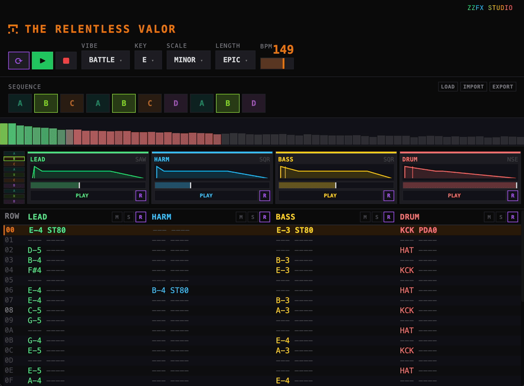

# ZzFX Studio

[](https://www.npmjs.com/package/zzfx-studio)
[](./LICENSE)

An algorithmic chiptune tracker that generates 4-channel retro songs instantly using pure math -- no samples, no AI, no network calls. Built for indie game devs who need quick retro audio for game jams and chiptune hobbyists who enjoy the creative process.

Built with ZzFX + ZzFXM for audio synthesis in ~1KB.



## Quick Start

Run it right now, no install needed:

```sh
npx zzfx-studio
```

Or use the PWA -- no install at all:

**[thejustinwalsh.github.io/zzfx-studio](https://thejustinwalsh.github.io/zzfx-studio)**

## Features

- **Instant song generation** -- click and it's done, <10ms
- **5 vibe templates** -- Adventure, Battle, Dungeon, Title Screen, Boss
- **4-channel tracker grid** -- Lead, Harmony, Bass, Drums with note effects
- **Per-channel regeneration** -- don't like the bass line? regenerate just that channel
- **Live playback** -- BPM changes, mute/solo, and instrument swaps while playing
- **Multi-project support** -- save and switch between songs (persisted to localStorage)
- **Export** -- copy ESM code, download .js, or export .wav
- **Import** -- load previously exported .zzfx files back in
- **Oscilloscope** -- real-time frequency visualization colored by active notes
- **ADSR visualization** -- see envelope shapes on each instrument card
- **Desktop app** -- runs as a native window via Neutralino.js on macOS, Linux, and Windows
- **PWA** -- works offline with service worker support

## Supported Platforms

| Platform | Architecture |
|---|---|
| macOS | ARM64 (Apple Silicon), x64 (Intel) |
| Linux | x64, ARM64 |
| Windows | x64 |

## Generation Engine

Songs are built algorithmically using proven music generation techniques:

1. **Drums first** -- kick templates + probability-weighted snare + gap-filling hats
2. **Bass** -- Euclidean rhythm timing + scale-constrained note pools
3. **Melody** -- constrained random walk with motif repetition
4. **Harmony** -- reactive gap-fill with arpeggiated chord tones

All melodic content is locked to the selected key/scale. Each vibe template controls density, BPM range, preferred scales, and effect probability.

### Note Effects

8 retro-authentic per-note effects: Slide Up, Slide Down, Vibrato, Detune, Staccato, Pitch Drop, Bit Crush, Tremolo.

## Using Songs in Your Game

Install the player. Use `zzfx` too if you want sound effects alongside music:

```sh
npm install @zzfx-studio/zzfxm zzfx    # music + sound effects
npm install @zzfx-studio/zzfxm          # music only (micro build, ~1.4KB gzipped)
```

### Copy Oneliner

Paste where you want the song to play:

```javascript
zzfxm([...],[...],[...],120);
```

### Copy Code

Copies the full snippet shown in the export modal -- imports, song data, and playback call. Useful as a starting point for integrating into your project.

### Export JS

Saves a `.js` file for archiving or sharing. Includes a `// @zzfx-studio` metadata comment for lossless re-import back into the app. Uses the micro build.

### Export WAV

Renders the song to a `.wav` file.

## Development

```bash
pnpm install
pnpm dev
```

### Project Structure

```
apps/
  zzfx-studio/           -- web app (Expo + React Native Web)
    src/
      engine/             -- generation engine (scales, drums, bass, melody, harmony, effects)
      components/         -- UI components
      theme/              -- colors, typography, layout constants
      store.ts            -- zustand store with multi-project persistence
packages/
  zzfx-studio/            -- desktop launcher (npx zzfx-studio)
    platforms/             -- per-platform Neutralino binaries
  zzfxm/                   -- ZzFXM player package (@zzfx-studio/zzfxm)
```

### Tech Stack

- **React Native** + **React Native Web** (web-first)
- **React Native Skia** for waveform/ADSR visualization
- **Expo 55** with Metro bundler
- **ZzFX** + **ZzFXM** -- ~1KB audio engine
- **Neutralino.js** -- lightweight desktop shell
- **Zustand** for state management with persistence
- **Turbo** monorepo build orchestration
- **pnpm** package manager

## License

[MIT](LICENSE)

## Credits

- [ZzFX](https://github.com/KilledByAPixel/ZzFX) by Frank Force -- tiny JavaScript sound engine
- [ZzFXM](https://github.com/keithclark/ZzFXM) by Keith Clark -- tiny music renderer
